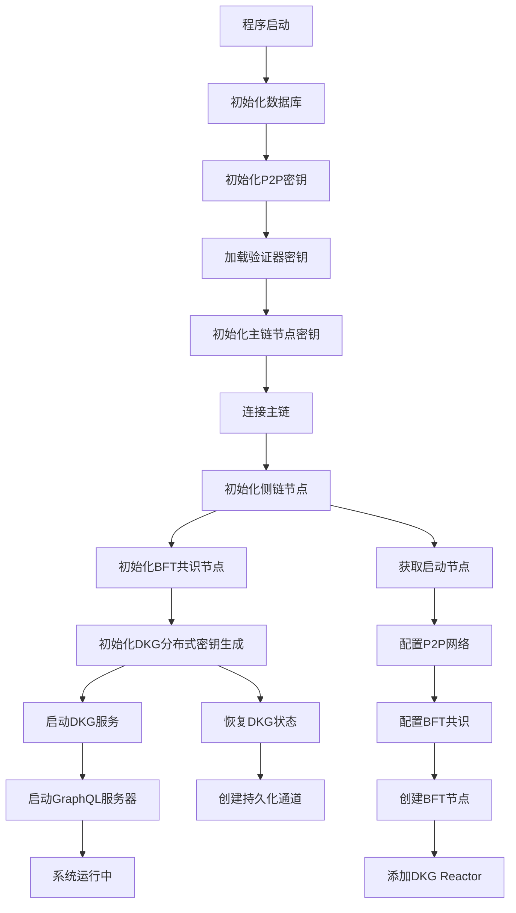
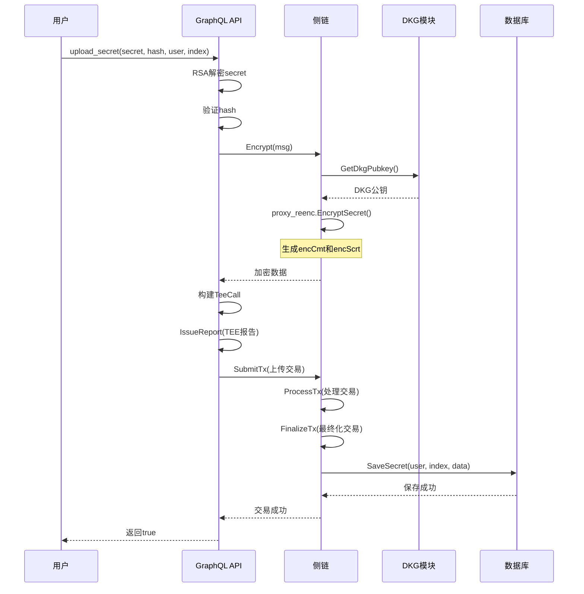
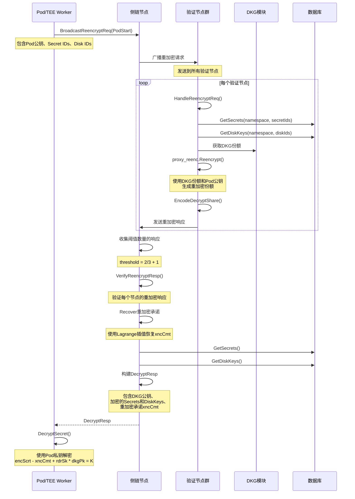
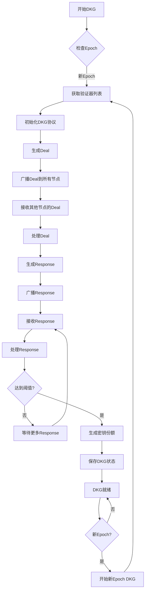
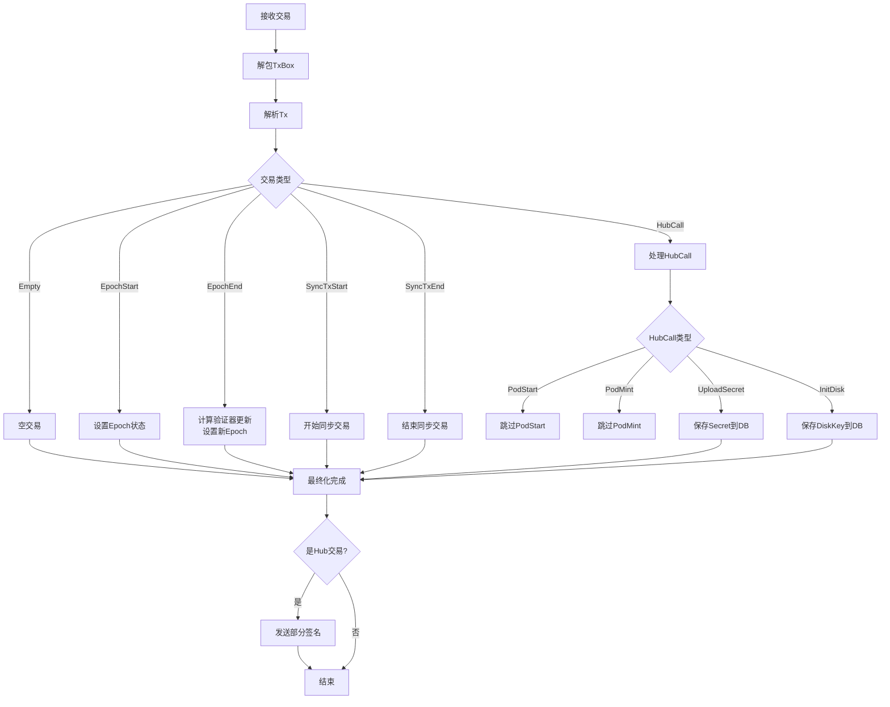
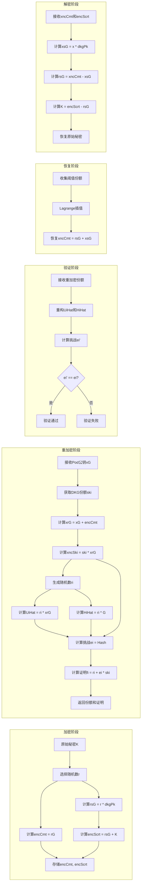
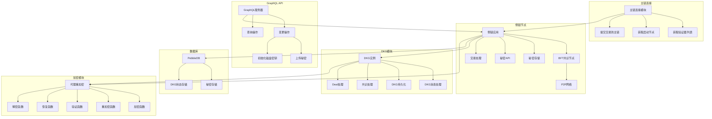
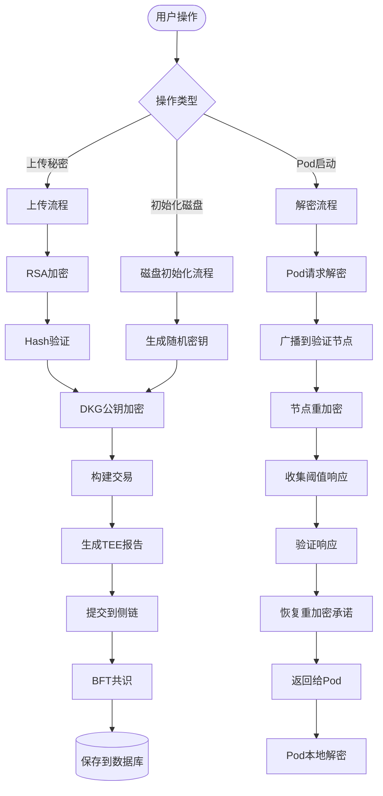

# tee-dsecret 逻辑架构图

## 1. 系统初始化流程

## 2. 秘密上传流程

## 3. 秘密解密流程（Pod启动时）

## 4. DKG分布式密钥生成流程

## 5. 侧链交易处理流程

## 6. 代理重加密（Proxy Re-encryption）流程

## 7. 系统组件架构

## 8. 数据流图

## 关键概念说明

### DKG (Distributed Key Generation)
- **目的**: 在多个验证节点之间分布式生成一个共享密钥
- **阈值**: 需要 2/3 + 1 个节点才能恢复密钥
- **用途**: 用于加密和解密用户秘密

### 代理重加密 (Proxy Re-encryption)
- **目的**: 允许将使用DKG公钥加密的密文转换为使用Pod公钥加密的密文
- **特点**: 验证节点不需要知道原始秘密，只需要使用自己的DKG份额进行重加密
- **安全性**: 使用NIZK（零知识证明）确保重加密的正确性

### 侧链 (Side Chain)
- **共识**: 使用CometBFT (Tendermint) BFT共识
- **存储**: 使用PebbleDB存储加密的秘密数据
- **功能**: 处理秘密的上传、存储和重加密请求

### TEE (Trusted Execution Environment)
- **支持**: SGX、SEV-SNP、TDX
- **用途**: 生成TEE报告，证明代码在可信环境中运行
- **验证**: 主链验证TEE报告的有效性

## 安全特性

1. **分布式密钥**: 密钥分散在多个节点，单个节点无法恢复完整密钥
2. **阈值加密**: 需要超过2/3的节点参与才能解密
3. **零知识证明**: 重加密过程使用NIZK证明，确保正确性
4. **TEE验证**: 使用TEE报告确保代码在可信环境中运行
5. **端到端加密**: 从用户上传到Pod解密全程加密

