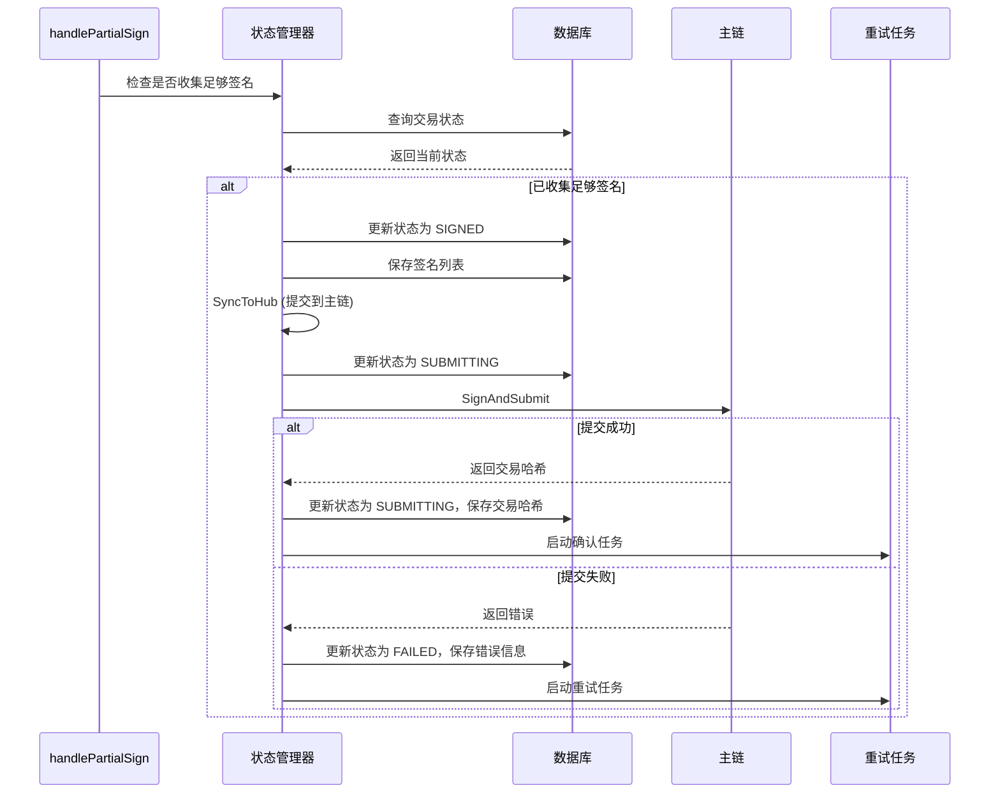

# 交易提交可靠性保障设计方案

## 一、问题分析

### 1.1 当前交易提交流程

```
用户提交 → 侧链处理 → 生成部分签名 → 收集阈值签名 → 同步到主链 (SyncToHub)
                                                              ↓
                                                        提交成功/失败
                                                              ↓
                                                        更新状态 (SyncEnd)
```

### 1.2 潜在失败场景

根据代码分析，以下场景可能导致交易丢失：

1. **主链提交失败**
   - 网络错误（连接超时、网络中断）
   - 主链节点不可用
   - Gas不足
   - 交易格式错误
   - 主链RPC错误

2. **部分签名收集失败**
   - 节点离线导致无法收集足够签名
   - P2P网络故障
   - 签名验证失败

3. **状态同步问题**
   - 即使提交失败也会调用 SyncEnd，导致状态不一致
   - 没有交易状态跟踪机制

4. **系统崩溃**
   - 提交过程中系统崩溃
   - 没有持久化待提交交易列表

## 二、核心设计思路

### 2.1 设计原则

1. **状态持久化**: 所有关键状态必须持久化到数据库
2. **幂等性**: 提交操作必须支持重试，避免重复提交
3. **确认机制**: 提交后必须确认交易在主链上的状态
4. **重试策略**: 失败交易必须自动重试
5. **状态跟踪**: 完整跟踪交易生命周期

### 2.2 交易状态机

```
┌─────────────┐
│  PENDING    │  交易已上链，等待部分签名
└──────┬──────┘
       │
       ▼
┌─────────────┐
│ SIGNING     │  正在收集部分签名
└──────┬──────┘
       │
       ▼
┌─────────────┐
│ SIGNED      │  已收集足够签名，准备提交
└──────┬──────┘
       │
       ▼
┌─────────────┐
│ SUBMITTING  │  正在提交到主链
└──────┬──────┘
       │
   ┌───┴───┐
   ▼       ▼
┌──────────┐  ┌──────────┐
│ CONFIRMED│  │  FAILED  │
└──────────┘  └────┬─────┘
                   │
                   ▼
            ┌──────────┐
            │ RETRYING │
            └────┬─────┘
                 │
                 ▼
            ┌──────────┐
            │ SUBMITTING│
            └──────────┘
```

## 三、解决方案设计

### 3.1 交易状态管理

#### 3.1.1 状态数据结构

```go
type TxSubmissionStatus struct {
    TxIndex    int64     // 交易索引
    Status     TxStatus  // 交易状态
    Call       types.Call // 交易调用数据
    Sigs       [][]byte   // 部分签名列表
    CreatedAt  int64      // 创建时间
    UpdatedAt  int64      // 更新时间
    SubmittedAt int64     // 提交时间
    ConfirmedAt int64     // 确认时间
    RetryCount int        // 重试次数
    LastError  string     // 最后错误信息
    MainChainTxHash string // 主链交易哈希
}

type TxStatus string

const (
    TxStatusPending   TxStatus = "pending"    // 等待部分签名
    TxStatusSigning   TxStatus = "signing"    // 正在收集签名
    TxStatusSigned    TxStatus = "signed"     // 已收集足够签名
    TxStatusSubmitting TxStatus = "submitting" // 正在提交
    TxStatusConfirmed TxStatus = "confirmed"  // 已确认
    TxStatusFailed    TxStatus = "failed"     // 失败
    TxStatusRetrying  TxStatus = "retrying"   // 重试中
)
```

#### 3.1.2 状态存储

- 所有交易状态存储在数据库中
- 使用 `tx_submission_status_{txIndex}` 作为键
- 使用事务确保状态更新的一致性

### 3.2 改进的提交流程

#### 3.2.1 提交流程设计



#### 3.2.2 关键改进点

1. **状态持久化**: 在每个关键步骤都保存状态到数据库
2. **错误处理**: 提交失败时不调用 SyncEnd，保持状态一致
3. **交易哈希保存**: 保存主链返回的交易哈希用于后续确认

### 3.3 交易确认机制

#### 3.3.1 确认流程

```go
type TxConfirmationChecker struct {
    chainManager *ChainManager
    db           *DB
    checkInterval time.Duration
    maxConfirmBlocks int // 确认需要的区块数
}

// 定期检查待确认交易
func (c *TxConfirmationChecker) CheckPendingTransactions() {
    // 1. 查询所有状态为 SUBMITTING 的交易
    // 2. 查询主链交易状态
    // 3. 确认交易是否已上链
    // 4. 更新交易状态
}
```

#### 3.3.2 确认策略

- **定期轮询**: 定期查询主链交易状态
- **事件监听**: 监听主链事件（如果有）
- **多重确认**: 等待多个区块确认
- **超时处理**: 超过一定时间未确认的交易标记为失败

### 3.4 重试机制

#### 3.4.1 重试策略

```go
type RetryPolicy struct {
    MaxRetries      int           // 最大重试次数
    InitialDelay    time.Duration // 初始延迟
    MaxDelay        time.Duration // 最大延迟
    BackoffStrategy BackoffStrategy // 退避策略
    RetryableErrors []error       // 可重试的错误类型
}

type BackoffStrategy string

const (
    BackoffExponential BackoffStrategy = "exponential" // 指数退避
    BackoffLinear      BackoffStrategy = "linear"      // 线性退避
    BackoffFixed       BackoffStrategy = "fixed"       // 固定延迟
)
```

#### 3.4.2 重试任务

```go
type RetryTask struct {
    txIndex    int64
    retryCount int
    nextRetry  time.Time
    lastError  error
}

type RetryScheduler struct {
    tasks chan *RetryTask
    policy *RetryPolicy
}
```

#### 3.4.3 重试条件

**可重试错误**:
- 网络错误（连接超时、网络中断）
- 主链暂时不可用
- RPC错误（非致命错误）
- Gas估算错误

**不可重试错误**:
- 交易格式错误
- 签名错误
- 权限错误
- 业务逻辑错误

### 3.5 失败恢复机制

#### 3.5.1 后台重试任务

```go
type TxRetryManager struct {
    db            *DB
    chainManager  *ChainManager
    retryQueue    chan *RetryTask
    workers       []*RetryWorker
    policy        *RetryPolicy
}

// 启动重试管理器
func (m *TxRetryManager) Start() {
    // 1. 定期扫描失败的交易
    // 2. 根据重试策略调度重试
    // 3. 使用工作池并发重试
}
```

#### 3.5.2 恢复流程

```
1. 定期扫描状态为 FAILED 的交易
2. 检查重试次数和重试策略
3. 计算下次重试时间
4. 到时间后重新提交
5. 更新状态和重试次数
```

### 3.6 幂等性保障

#### 3.6.1 交易去重

- **交易哈希**: 使用交易内容的哈希作为唯一标识
- **交易索引**: 使用 txIndex 作为唯一标识
- **主链检查**: 提交前检查主链是否已有相同交易

#### 3.6.2 重复提交检测

```go
// 提交前检查主链
func (s *SideChain) CheckTxExists(call types.Call) (bool, error) {
    // 1. 计算交易哈希
    // 2. 查询主链是否已有相同交易
    // 3. 如果有，标记为已确认
}
```

### 3.7 关键代码修改点

#### 3.7.1 修改 SyncToHub

```go
func (s *SideChain) SyncToHub(txIndex int64, sigs [][]byte) error {
    // 1. 加载交易状态
    status, err := s.LoadTxStatus(txIndex)
    if err != nil {
        return err
    }
    
    // 2. 检查是否已提交
    if status.Status == TxStatusConfirmed {
        return nil // 已确认，直接返回
    }
    
    // 3. 更新状态为 SUBMITTING
    status.Status = TxStatusSubmitting
    status.Sigs = sigs
    status.UpdatedAt = time.Now().Unix()
    status.SubmittedAt = time.Now().Unix()
    s.SaveTxStatus(status)
    
    // 4. 提交到主链
    call, err := model.GetCodec[types.Call](GLOABL_STATE, "tx_index"+fmt.Sprint(txIndex))
    if err != nil {
        status.Status = TxStatusFailed
        status.LastError = err.Error()
        s.SaveTxStatus(status)
        return err
    }
    
    signer := dkg.NewDssSigner(s.dkg)
    signer.SetSigs(sigs)
    
    client := chains.MainChain.GetClient()
    txHash, err := client.SignAndSubmit(signer, *call, false, 0)
    
    if err != nil {
        // 5. 提交失败，更新状态为 FAILED
        status.Status = TxStatusFailed
        status.LastError = err.Error()
        status.RetryCount++
        s.SaveTxStatus(status)
        
        // 6. 启动重试任务（如果是可重试错误）
        if s.isRetryableError(err) {
            s.retryManager.ScheduleRetry(txIndex)
        }
        
        return err
    }
    
    // 7. 提交成功，更新状态
    status.Status = TxStatusSubmitting
    status.MainChainTxHash = txHash
    s.SaveTxStatus(status)
    
    // 8. 启动确认任务
    s.confirmationChecker.ScheduleCheck(txIndex, txHash)
    
    // 9. 只有在确认成功后才调用 SyncEnd
    // (移到确认任务中)
    
    return nil
}
```

#### 3.7.2 修改 handlePartialSign

```go
func (s *SideChain) handlePartialSign(msg *model.BlockPartialSign) error {
    // 1. 保存部分签名
    err := s.SavePartialSig(msg.From, msg)
    if err != nil {
        return err
    }
    
    // 2. 检查是否收集足够签名
    sigs, err := s.SigListOfTx(msg.TxIndex)
    if err != nil {
        return err
    }
    
    if len(sigs) < s.dkg.Threshold+1 {
        return nil // 签名不足，继续等待
    }
    
    // 3. 加载交易状态
    status, err := s.LoadTxStatus(msg.TxIndex)
    if err != nil {
        // 如果状态不存在，创建新状态
        status = &TxSubmissionStatus{
            TxIndex: msg.TxIndex,
            Status:  TxStatusPending,
        }
    }
    
    // 4. 检查是否已经处理过
    if status.Status == TxStatusConfirmed {
        return nil // 已确认，忽略
    }
    
    if status.Status == TxStatusSubmitting || status.Status == TxStatusRetrying {
        return nil // 正在提交或重试中，忽略
    }
    
    // 5. 更新状态并提交
    status.Status = TxStatusSigned
    status.Sigs = extractSigs(sigs)
    s.SaveTxStatus(status)
    
    // 6. 提交到主链
    return s.SyncToHub(msg.TxIndex, extractSigs(sigs))
}
```

#### 3.7.3 新增确认检查器

```go
type TxConfirmationChecker struct {
    sideChain *SideChain
    interval  time.Duration
    stopCh    chan struct{}
}

func (c *TxConfirmationChecker) Start() {
    ticker := time.NewTicker(c.interval)
    defer ticker.Stop()
    
    for {
        select {
        case <-ticker.C:
            c.checkPendingTransactions()
        case <-c.stopCh:
            return
        }
    }
}

func (c *TxConfirmationChecker) checkPendingTransactions() {
    // 1. 查询所有状态为 SUBMITTING 的交易
    // 2. 查询主链交易状态
    // 3. 确认交易是否已上链
    // 4. 如果已确认，更新状态并调用 SyncEnd
    // 5. 如果超时，标记为失败并重试
}
```

#### 3.7.4 新增重试管理器

```go
type TxRetryManager struct {
    sideChain *SideChain
    policy    *RetryPolicy
    retryQueue chan *RetryTask
    workers    []*RetryWorker
}

func (m *TxRetryManager) Start() {
    // 1. 启动工作池
    // 2. 定期扫描失败交易
    // 3. 根据重试策略调度重试
}

func (m *TxRetryManager) ScheduleRetry(txIndex int64) {
    // 1. 加载交易状态
    // 2. 检查重试次数
    // 3. 计算下次重试时间
    // 4. 添加到重试队列
}
```

## 四、监控和告警

### 4.1 监控指标

1. **提交成功率**: 成功提交的交易数 / 总交易数
2. **平均确认时间**: 从提交到确认的平均时间
3. **重试率**: 需要重试的交易比例
4. **失败率**: 最终失败的交易比例
5. **待确认交易数**: 当前状态为 SUBMITTING 的交易数
6. **失败交易数**: 当前状态为 FAILED 的交易数

### 4.2 告警规则

1. **提交失败率过高**: 超过阈值时告警
2. **待确认交易积压**: 待确认交易数超过阈值时告警
3. **重试次数过多**: 某个交易重试次数超过阈值时告警
4. **确认时间过长**: 交易确认时间超过阈值时告警

## 五、实施步骤

### 5.1 第一阶段：基础状态管理

1. 添加交易状态数据结构
2. 实现状态持久化
3. 修改 SyncToHub 添加状态管理
4. 修改 handlePartialSign 添加状态检查

### 5.2 第二阶段：确认机制

1. 实现交易确认检查器
2. 添加主链交易查询功能
3. 实现确认状态更新
4. 修改 SyncEnd 调用逻辑

### 5.3 第三阶段：重试机制

1. 实现重试策略
2. 实现重试管理器
3. 添加重试调度
4. 实现错误分类

### 5.4 第四阶段：监控和优化

1. 添加监控指标
2. 实现告警机制
3. 性能优化
4. 测试和验证

## 六、测试策略

### 6.1 单元测试

- 状态管理测试
- 重试策略测试
- 确认机制测试

### 6.2 集成测试

- 完整提交流程测试
- 失败场景测试
- 重试场景测试
- 确认场景测试

### 6.3 压力测试

- 高并发提交测试
- 大量失败交易测试
- 长时间运行测试

### 6.4 故障测试

- 主链故障测试
- 网络中断测试
- 系统崩溃测试

## 七、总结

### 7.1 核心保障机制

1. **状态持久化**: 确保关键状态不丢失
2. **确认机制**: 确保交易真的在主链上
3. **重试机制**: 自动重试失败的交易
4. **幂等性**: 避免重复提交
5. **监控告警**: 及时发现和处理问题

### 7.2 预期效果

- **零丢失**: 所有交易都能最终提交到主链
- **高可靠性**: 即使出现故障也能自动恢复
- **可追溯**: 完整跟踪每个交易的状态
- **可监控**: 实时监控交易提交情况

### 7.3 注意事项

1. **性能影响**: 状态持久化会增加I/O开销，需要优化
2. **存储空间**: 长期保存交易状态需要定期清理
3. **并发控制**: 多线程访问状态需要加锁
4. **数据一致性**: 确保状态更新的一致性


